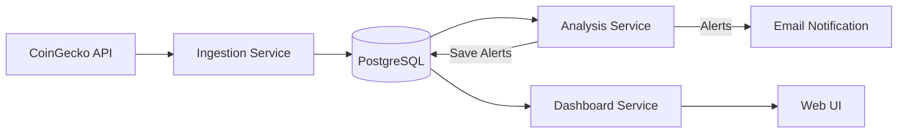
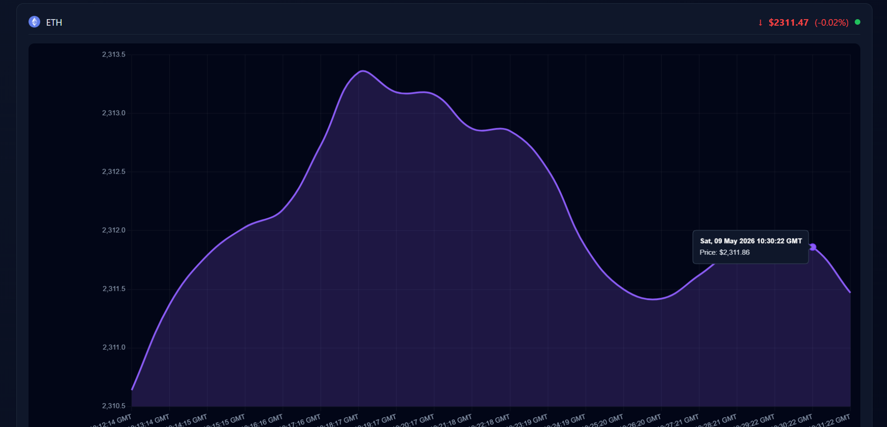

# 🚀 Crypto Market Monitoring & Alert System

A real-time crypto data pipeline that ingests market prices, analyzes movements, and delivers intelligent alerts through a live dashboard.

---

## 📊 System Overview



---

## 🧠 Key Features

## 🔹 Real-Time Data Pipeline

- Continuous price ingestion (BTC, ETH, XRP)
- Reliable storage in PostgreSQL
- Automated data flow between services

## 🔹 Intelligent Analysis Engine
- Percentage change detection
- Configurable alert thresholds
- Smart alert system:
- Cooldown mechanism
- State tracking (prevents spam)

## 🔹 Alerting System
- 📧 Email notifications (BUY / SELL signals)
- 🔔 Real-time popup alerts (with sound)
- 📋 Persistent alert history

## 🔹 Interactive Dashboard
- Live updating charts (AJAX)
- Price tracking with:
   - Trend arrows (↑ ↓)
   - % change
   - Color indicators (green/red)
- Clean UI with alert table

---

## 🏗️ Architecture

This project follows a microservices-based architecture:

```text
crypto-project/
│
├── ingestion-service/     
├── analysis-service/      
├── dashboard-service/     
├── docker-compose.yml     
```

---

## ⚙️ Tech Stack

| Layer    | Technology     |
| -------- | -------------- |
| Backend  | Python (Flask) |
| Database | PostgreSQL     |
| Frontend | HTML, CSS, JS  |
| Charts   | Chart.js       |
| DevOps   | Docker         |

---

## 🚀 How It Works
## 1.Ingestion Service
-  Fetches crypto prices every minute
-  Stores data in PostgreSQL

## 2.Analysis Service
-  Reads latest data
-  Calculates price changes
-  Triggers alerts based on thresholds
## 3.Dashboard Service
-   Displays live charts
-   Shows alerts in real-time
-   Provides API endpoints

---

## 🔔 Alert Logic

- Alerts triggered when price change exceeds threshold (e.g. ±3%)
- BUY signal → price drop
- SELL signal → price spike
- Cooldown prevents repeated alerts

---

## 📈 Supported Assets
 - Bitcoin (BTC)
 - Ethereum (ETH)
 - Ripple (XRP)

---

## 📷 Screenshots

### 🔹 Live Dashboards




### 🔹 Alert Table


---

## 🚀 Current Release

### Version 1.0
Features included in this release:
- Real-time crypto ingestion
- PostgreSQL storage
- Analysis engine
- Email alerts
- Live dashboard
- Alert history
- Dockerized architecture

Future versions will introduce:
- AI market prediction
- Advanced analytics
- Candlestick trading charts
- Cloud deployment