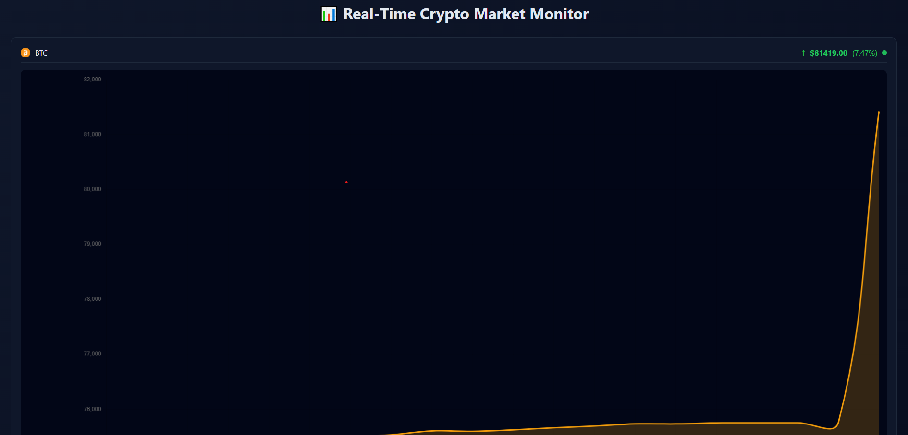
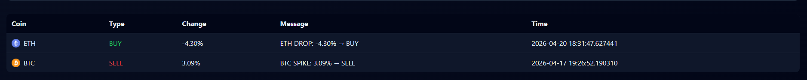

# 🚀 Crypto Market Monitoring & Alert System

A real-time crypto data pipeline that ingests market prices, analyzes movements, and delivers intelligent alerts through a live dashboard.

---

## 📊 System Overview

```mermaid
flowchart LR
    A[CoinGecko API] --> B[Ingestion Service]
    B --> C[(PostgreSQL)]
    C --> D[Analysis Service]
    D -->|Alerts| E[Email Notification]
    D -->|Save Alerts| C
    C --> F[Dashboard Service]
    F --> G[Web UI]

---

🧠 Key Features
🔹 Real-Time Data Pipeline
    Continuous price ingestion (BTC, ETH, XRP)
    Reliable storage in PostgreSQL
    Automated data flow between services

🔹 Intelligent Analysis Engine
    Percentage change detection
    Configurable alert thresholds
    Smart alert system:
    Cooldown mechanism
    State tracking (prevents spam)

🔹 Alerting System
    📧 Email notifications (BUY / SELL signals)
    🔔 Real-time popup alerts (with sound)
    📋 Persistent alert history

🔹 Interactive Dashboard
    Live updating charts (AJAX)
    Price tracking with:
        Trend arrows (↑ ↓)
        % change
        Color indicators (green/red)
    Clean UI with alert table

---

🏗️ Architecture

This project follows a microservices-based architecture:
crypto-project/
│
├── ingestion-service/     # Fetches market data
├── analysis-service/      # Processes data & triggers alerts
├── dashboard-service/     # UI + API layer
├── docker-compose.yml     # Orchestration


---

⚙️ Tech Stack

| Layer    | Technology     |
| -------- | -------------- |
| Backend  | Python (Flask) |
| Database | PostgreSQL     |
| Frontend | HTML, CSS, JS  |
| Charts   | Chart.js       |
| DevOps   | Docker         |

---

🚀 How It Works
1.Ingestion Service
    Fetches crypto prices every minute
    Stores data in PostgreSQL

2.Analysis Service
    Reads latest data
    Calculates price changes
    Triggers alerts based on thresholds
3.Dashboard Service
    Displays live charts
    Shows alerts in real-time
    Provides API endpoints


---

🔔 Alert Logic
    Alerts triggered when price change exceeds threshold (e.g. ±3%)
    BUY signal → price drop
    SELL signal → price spike
    Cooldown prevents repeated alerts

---

📈 Supported Assets
    Bitcoin (BTC)
    Ethereum (ETH)
    Ripple (XRP)

---

## 📷 Screenshots

### 🔹 Live Dashboard


### 🔹 Alert Popup
